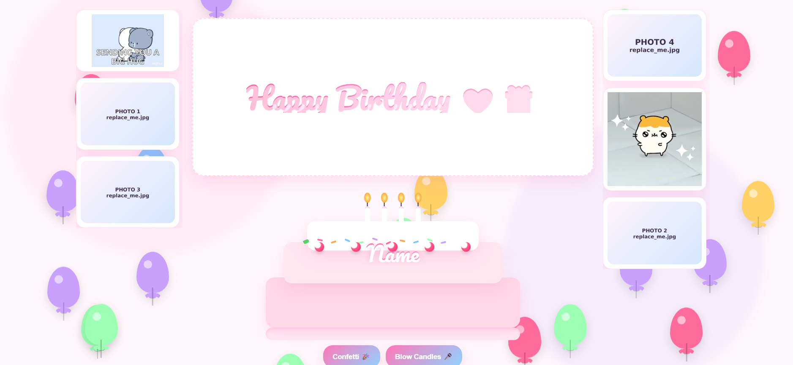
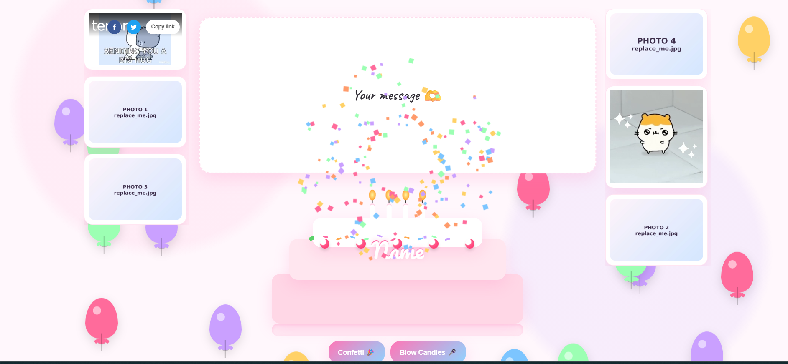

# Happy Birthday Card 🎉

A single-page, mobile-friendly birthday card template (no build tools).  
Flip card message, confetti, “blow the candles” cake, side galleries, and Tenor GIF embeds.





## Demo Setup
Open `index.html` locally or host it (e.g., GitHub Pages). Works on desktop & mobile.

---

## Quick Start
1. **Open** `index.html` and edit the **CONFIG** block near the top:
   ```html
   <script id="CONFIG">
     window.CARD_CONFIG = {
       title: "Happy Birthday 💗🎁",
       name:  "Your Name",
       message: `Your message here`,
       images: {
         left1:  "assets/photo1.jpg",
         left2:  "assets/photo3.jpg",
         right1: "assets/photo4.jpg",
         right2: "assets/photo2.jpg",
       },
       gifs: {
         left:  "8205346511324572804",
         right: "13882760074367825905"
       }
     };
   </script>
