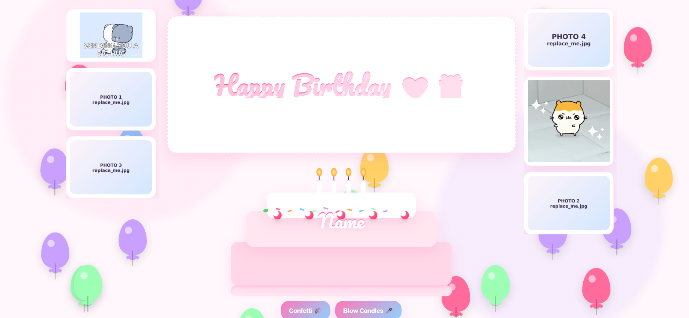

# Happy birthday card

One HTML file. Open `index.html` in a browser, or put the folder on GitHub Pages.

The card flips, confetti fires, candles go out if the mic picks up a blow, balloons pop, photos open in a lightbox. Dark theme is `?t=dark`. Name and message can come from the URL: `?name=Ada&msg=hi`.

Edit the `CARD_CONFIG` block near the top of `index.html`. `name` there is `"Name"`. Photos are `assets/photo1.jpg` to `photo4.jpg`. The files in the repo are placeholders. Replace them with real pictures, same names.

MIT. See LICENSE.
